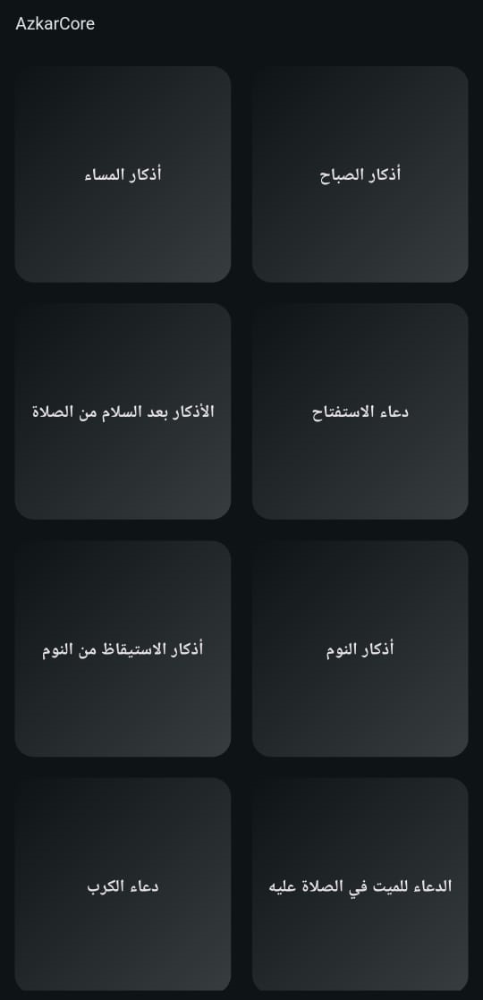

# AzkarCore App:
This is an Azkar app designed for Muslims, offering a collection of essential daily Azkar.

## Features:

- Azkar List: Includes Azkar with descriptions (if available).
- Responsive Design: Adapts to different screen sizes while maintaining usability.
- Portrait Mode: The app is locked to portrait mode for a consistent user experience.
- Counter with Haptic Feedback: The counter decreases as the user taps, providing haptic feedback until it reaches zero, at which point the color changes, and haptic feedback is disabled.
- Light and Dark Mode: The app supports both light and dark themes, changing automatically based on the system setting.

## Screenshots:

